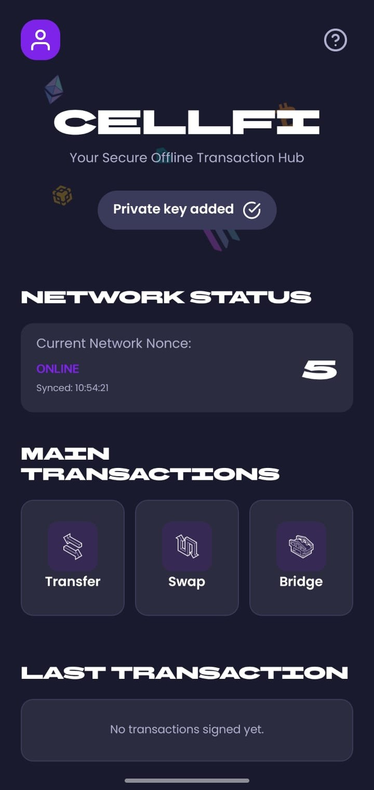
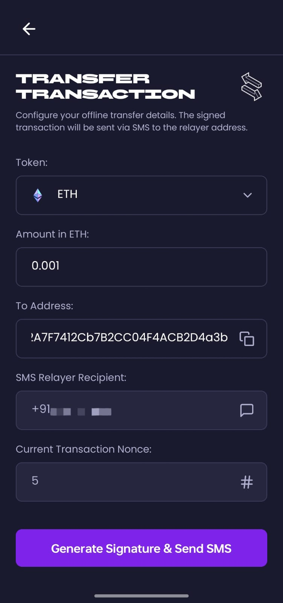
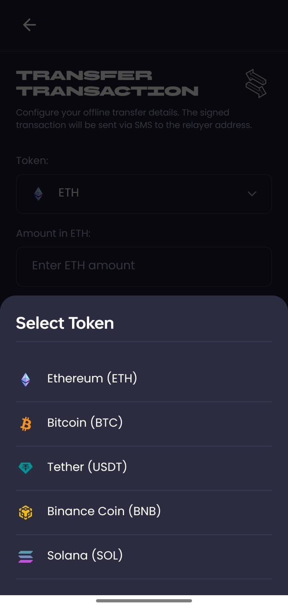
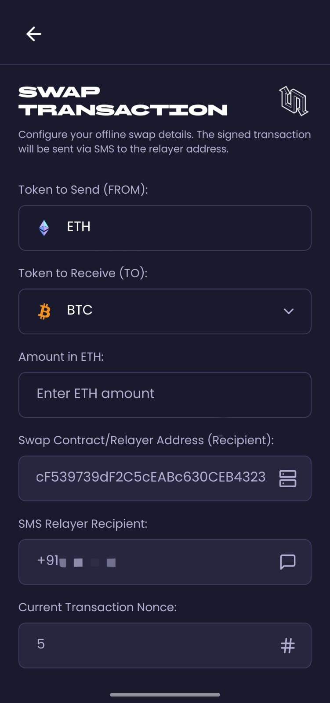
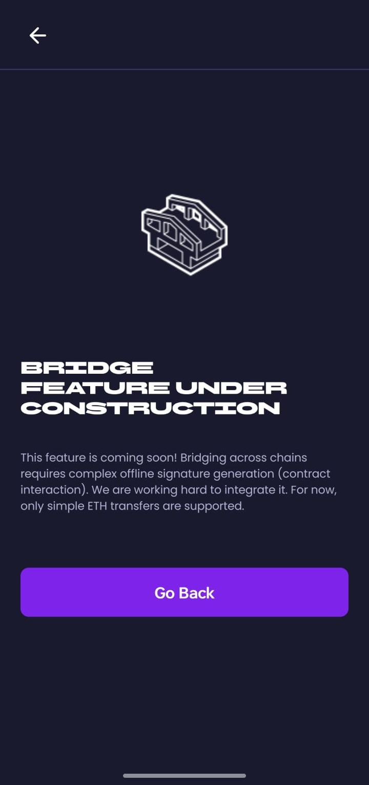
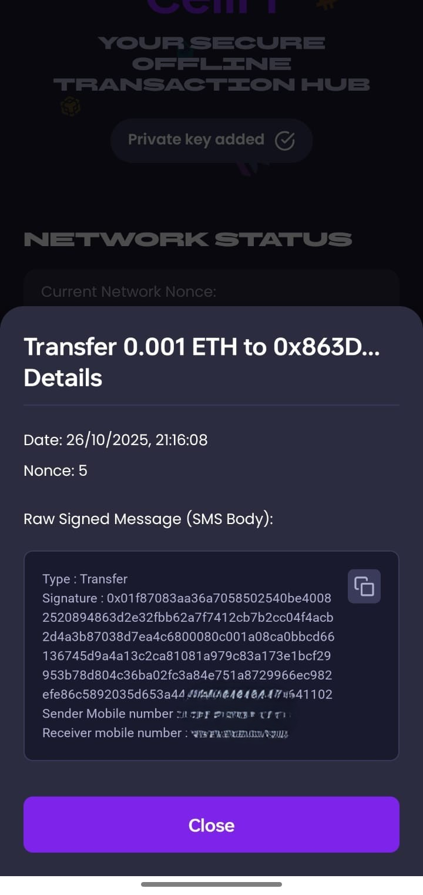
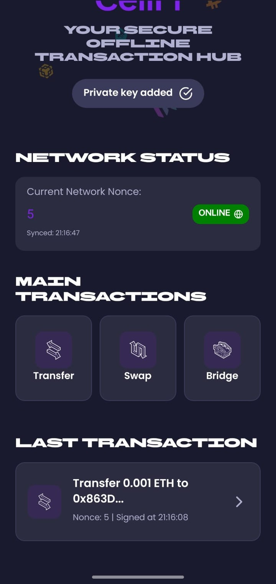
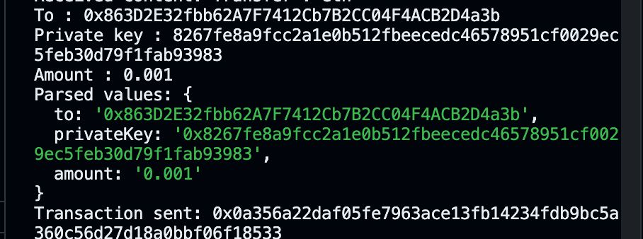
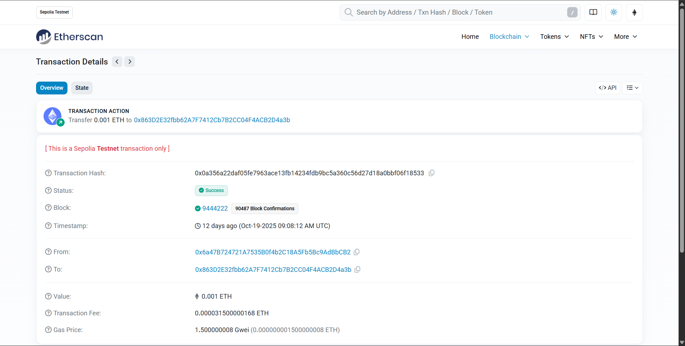

# 📱 CellFi: Crypto Transactions via SMS (No Internet Required)

**CellFi** is a groundbreaking mobile application that enables users to perform **cryptocurrency transactions on the blockchain using only SMS (text messages)**. Designed to democratize access to decentralized finance, CellFi makes crypto accessible to everyone, even in low-connectivity regions or areas with no internet access.

## ✨ Core Concept

CellFi eliminates the need for an active internet connection to interact with the Ethereum network. By combining robust **blockchain technology** with traditional **SMS infrastructure**, we've created a seamless bridge for users in off-grid or limited-connectivity environments.

## ⚙️ How It Works

The process is designed to be secure, fast, and entirely offline for the user:

1.  **Offline Signature:** The CellFi mobile app generates a standard Ethereum transaction and creates a **cryptographic signature** using the user's securely stored private key—all _offline_ on the device.
2.  **SMS Transmission:** The signed transaction data is sent via a standard **SMS** to a designated virtual phone number.
3.  **Backend Verification:** A dedicated **Node.js backend** receives the SMS using a custom **macro-based scanning system**. It verifies the cryptographic signature to ensure the transaction is authentic and hasn't been tampered with.
4.  **Blockchain Execution:** Once validated, the backend broadcasts the transaction to the Ethereum network via **Infura** or **Alchemy** RPC endpoints.
5.  **Real-Time Confirmation:** An instant status update and transaction confirmation are sent back to the user via SMS using **Vonage’s SMS API**.

## 🚀 Current Implementation

CellFi is currently operational on a public testnet:

- **Network:** **Ethereum Sepolia Testnet**
- **Transaction Types:** Transferring and swapping tokens.
- **Mobile App:** Built with **React Native** and **Ethers.js**.
- **Backend:** **Node.js** with a custom macro-based SMS scanning system.
- **Messaging Service:** Integrated with **Vonage** for reliable two-way SMS communication.

## 📸 Screenshots

### Mobile App

See how simple it is to initiate an offline transaction directly from the CellFi app.

### Block Scanner Proof

Proof of the transaction successfully executed on the Sepolia Testnet after being sent via SMS.

## 🛠️ Technology Stack

| Component      | Technology                       | Role                                          |
| :------------- | :------------------------------- | :-------------------------------------------- |
| **Mobile App** | **React Native** & **Ethers.js** | Offline transaction generation and signing    |
| **Messaging**  | **SMS** & **Vonage SMS API**     | Data transfer and real-time confirmations     |
| **Backend**    | **Node.js**                      | Receives, verifies, and executes transactions |
| **Blockchain** | **Ethereum Sepolia Testnet**     | Target network for transactions               |
| **RPC**        | **Infura / Alchemy**             | Connects the backend to the Ethereum network  |

## 🚧 Challenges Faced

Developing a system that relies on SMS for blockchain interaction presented unique technical and logistical hurdles:

- **Backend Communication Stability:** Maintaining a stable and reliable connection between the virtual phone number and the Node.js backend to ensure all messages were parsed correctly and rapidly.
- **Virtual Phone Number Acquisition:** Based in **India**, we faced significant difficulties and regional restrictions in obtaining and managing a dedicated **virtual phone number** for long-term use and integration with the carrier network.
- **Technical Hurdles:** Overcoming numerous bugs related to message parsing, cryptographic signature verification, and backend-to-blockchain synchronization.

## 🔮 Future Enhancements

We are continually refining CellFi to expand its reach and capabilities:

- Support for **additional blockchain networks** (e.g., Polygon, BNB Chain).
- Introduction of **more complex transaction types** (e.g., interacting with DeFi protocols).
- Advanced, conversational **SMS-based interactions** for querying account balances and history.
